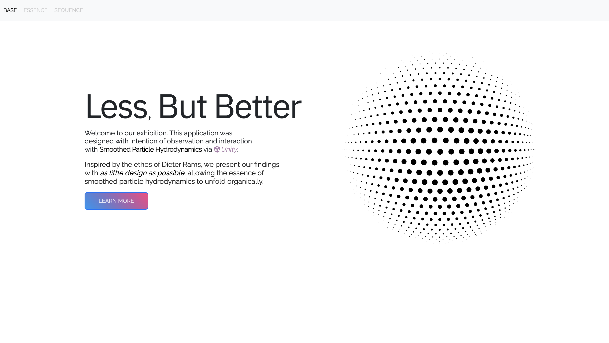

# Less, But Better

<div align="center">


## About
A Dieter Rams inspired web application built with React components showcasing a 'Smoothed Particle Hydrodynamics' simulation built using the Unity engine.

[Capstone Proposal repository](https://github.com/jeremyjosol/capstone)

[Unity practice repository](https://github.com/jeremyjosol/LessAndMore)

## Technologies Used

* _Github_
* _VSCode_
* _HTML_
* _CSS_
* _Bootstrap_
* _Javascript_
* _React_
* _Unity_
* _Firebase_

### Prerequisuites
> _Your computer or codespace should use **Node.js version 16** or greater. For more information, see_ [Node.js](https://nodejs.org/en).

## Application Setup

1. Clone the [repository](https://github.com/jeremyjosol/less-but-better) by either copying the link or entering the command in your terminal:
    ```
     $ git clone https://github.com/jeremyjosol/letter-but-better.git
    ```
2. After successfully cloning down the repository, navigate to the **'less-but-better'** directory:
      ```
       $ cd less-but-better
      ```
3. Before you can use or deploy the project, make sure to install its dependencies. Run the following command in your terminal:

    `$ npm install`

    > _This command will read the **package.json** file and install all the required packages_.

4. Once its dependencies are installed, you're ready to perform these available options:
    
### `$ npm start`

* Runs the app in the development mode. 

  * Open [http://localhost:3000](http://localhost:3000) to view it in your browser. 

  * The page will reload when you make changes. You may also see any lint errors in the console.

### `$ npm run build`

* Builds the app for production to the `build` folder.

  * It correctly bundles React in production mode and optimizes the build for the best performance.

  * The build is minified and the filenames include the hashes.

_Your app is ready to be deployed!_

### `$ npm run eject`

**Note: this is a one-way operation. Once you `eject`, you can't go back!**

> If you aren't satisfied with the build tool and configuration choices, you can `eject` at any time. This command will remove the single build dependency from your project.

> Instead, it will copy all the configuration files and the transitive dependencies (webpack, Babel, ESLint, etc) right into your project so you have full control over them. All of the commands except `eject` will still work, but they will point to the copied scripts so you can tweak them. At this point you're on your own.

> You don't have to ever use `eject`. The curated feature set is suitable for small and middle deployments, and you shouldn't feel obligated to use this feature. However we understand that this tool wouldn't be useful if you couldn't customize it when you are ready for it.

## Known Bugs
No known bugs.

## MIT License

Copyright (c) 2023 Jeremy Josol

Permission is hereby granted, free of charge, to any person obtaining a copy of this software and associated documentation files (the "Software"), to deal in the Software without restriction, including without limitation the rights to use, copy, modify, merge, publish, distribute, sublicense, and/or sell copies of the Software, and to permit persons to whom the Software is furnished to do so, subject to the following conditions: